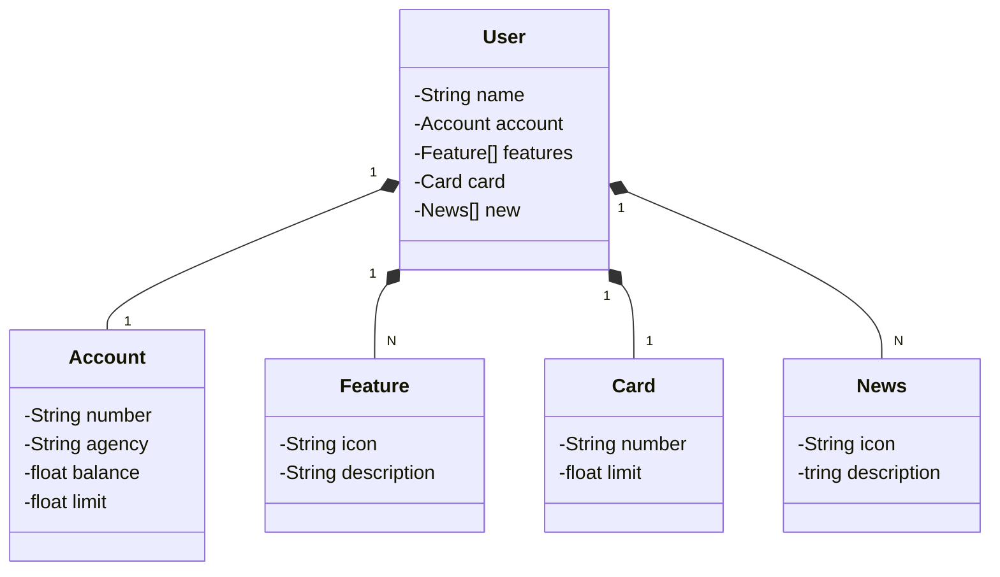

## 💻 Objetivo do projeto

Rest api para simular rotinas bancárias

## Design


## Diagrama de classe:


## Doc:
- **[Swagger](http://localhost:8080/swagger-ui/index.html#/)**

| Método | Endpoint           | Descrição                        | Autenticação |
|--------|--------------------|----------------------------------|--------------|
| GET    | /api/v1/users      | Lista todos os usuários          | Não          |
| GET    | /api/v1/users/{id} | Retorna um usuário pelo ID       | Não          |
| POST   | /api/users         | Cria um novo usuário             | Não          |


```json
{
  "name": "James Doe",
   "account": {
   "number":"00000000-0",
   "agency":"0000",
   "balance":1324.64,
   "limit":10000.00   
   },
  "features":[
    {
      "icon":"url",
      "description":"PIX"
    }
  ],
  "card":{
    "number":"xxxx xxxx xxxx 0000",
    "limit":1000.00    
    },
  "news":[
    {
      "icon":"url",
      "description":"O Santander tem soluções de crédito sob medida para você."
    }   
  ]
}
```

## 🛠 Tecnologias

As seguintes tecnologias foram utilizadas no desenvolvimento da API Rest do projeto:

- **[Java 17](https://www.oracle.com/java)**
- **[Spring Boot 3](https://spring.io/projects/spring-boot)**
- **[Gradle](https://gradle.org/)**
- **[PostgresSQL](https://www.postgresql.org/)**
- **[Lombok](https://projectlombok.org)**
- **[H2 Database](com.h2database)**