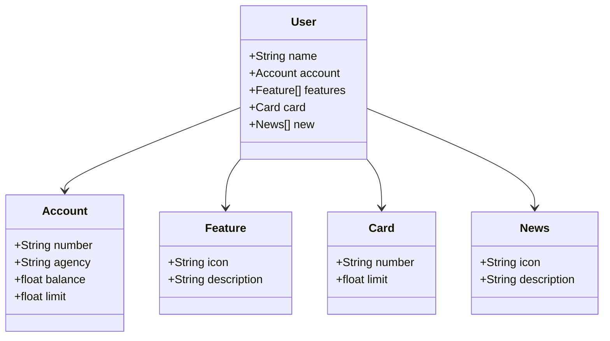

## 💻 Objetivo do projeto

Rest api para simular rotinas bancárias

## Diagrama de classe:

## 🛠 Tecnologias

As seguintes tecnologias foram utilizadas no desenvolvimento da API Rest do projeto:

- **[Java 17](https://www.oracle.com/java)**
- **[Spring Boot 3](https://spring.io/projects/spring-boot)**
- **[Gradle](https://gradle.org/)**
- **[PostgreSQL](https://www.postgresql.org/)**
- **[Lombok](https://projectlombok.org)**
- **[H2 Database](com.h2database)**
